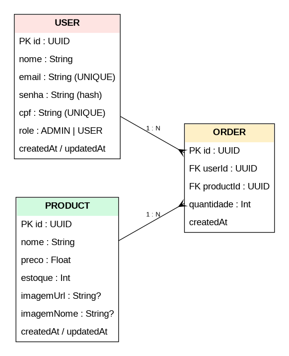
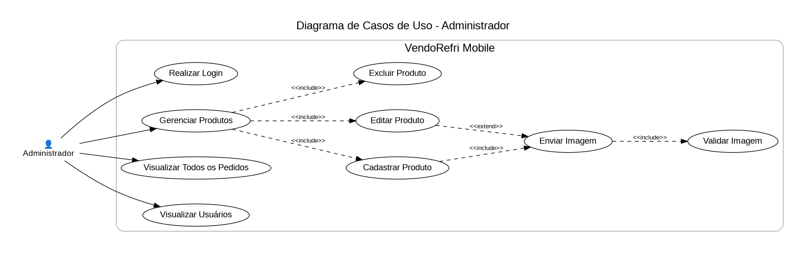
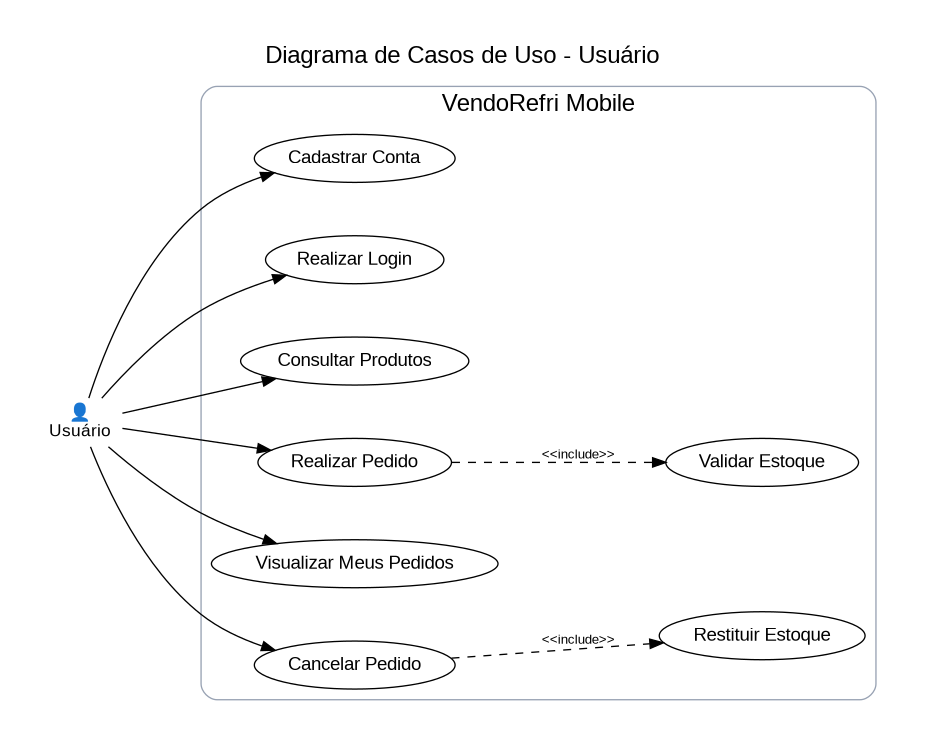
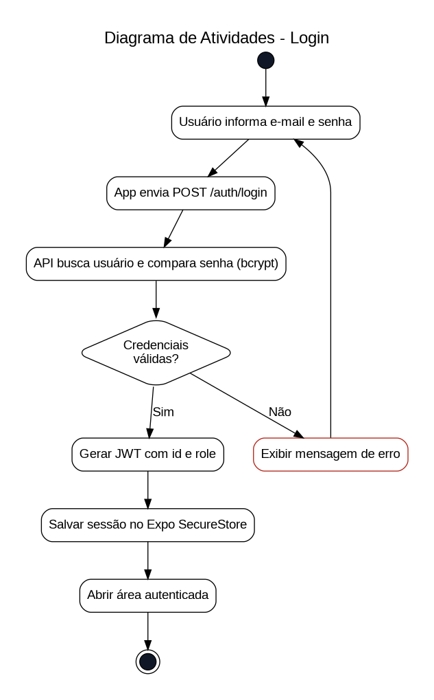
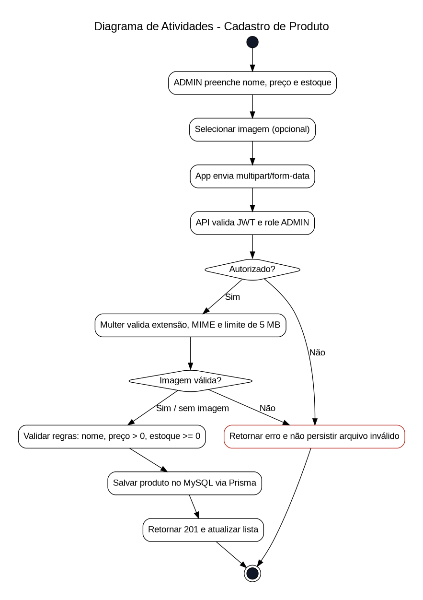
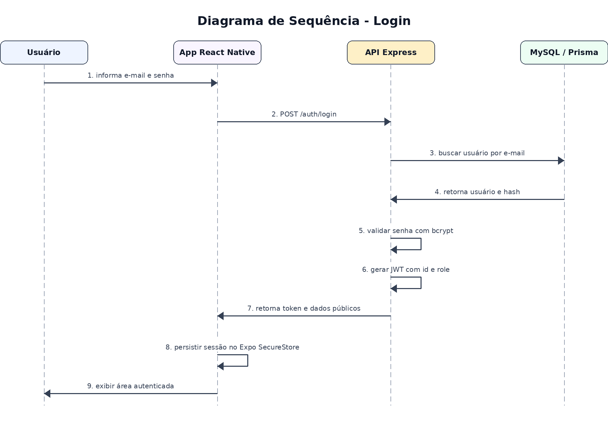
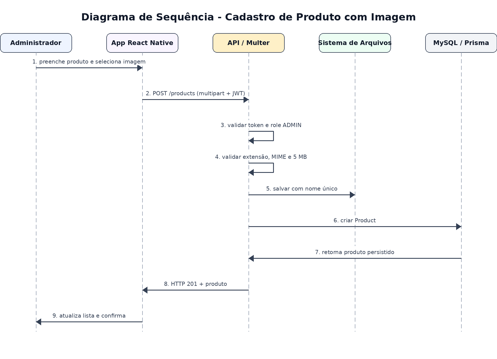

# VendoRefri Mobile
## Evolução de sistema de controle de produtos, estoque e pedidos para dispositivos móveis

**Aluno:** Lucas Nery Theodoro  
**Curso:** Tecnologia em Análise e Desenvolvimento de Sistemas - TADS  
**Projeto integrador:** Desenvolvimento para Dispositivos Móveis / Engenharia e Análise de Projeto de Software / Tech Forge  
**Ano:** 2026

---

## 1. Visão geral

O **VendoRefri Mobile** é a evolução do projeto VendoRefri desenvolvido em módulos anteriores. A versão atual reaproveita a arquitetura de backend em Node.js/Express, Prisma e MySQL e acrescenta um aplicativo React Native/Expo para acesso móvel, controle funcional por perfis e envio de imagens de produtos.

O projeto foi delimitado para atender a um problema simples e observável: pequenos comércios frequentemente precisam consultar o estoque, cadastrar produtos e registrar saídas sem depender de uma estação de trabalho. A interface móvel permite que o usuário consulte o catálogo e registre pedidos, enquanto o administrador gerencia o estoque e o cadastro de produtos.

## 2. Contextualização do problema

Pequenos estabelecimentos podem realizar controles de estoque por planilhas, anotações ou sistemas pouco acessíveis durante a rotina de atendimento. Esse cenário aumenta o risco de divergência entre estoque registrado e estoque disponível, dificulta a consulta rápida e pode gerar retrabalho.

O problema central adotado pelo projeto é:

> **Como permitir que um pequeno comércio consulte e atualize seu catálogo e estoque de forma simples por um dispositivo móvel, mantendo regras de acesso, rastreabilidade de pedidos e validação dos dados?**

A solução proposta é um aplicativo móvel conectado a uma API e a um banco relacional. O aplicativo oferece funcionalidades diferentes de acordo com o perfil autenticado.

## 3. Evolução do produto

A evolução considerada para o projeto é incremental:

1. **Versões iniciais:** aplicação de controle de vendas/produtos desenvolvida em PHP/MVC.
2. **Módulo anterior:** evolução para aplicação full stack com frontend React/Vite, API Node/Express, Prisma/MySQL, autenticação JWT, Docker e testes E2E.
3. **Versão atual:** reutilização da API e do modelo de dados, com evolução para aplicativo React Native/Expo, upload de imagens por Multer, validações de arquivo e regras explícitas de autorização `ADMIN` e `USER`.

Essa abordagem reduz retrabalho e mantém continuidade técnica do produto.

## 4. Persona e cliente

**Persona principal:** proprietário ou responsável por um pequeno comércio de bebidas/conveniência.

**Necessidades principais:**

- consultar rapidamente produtos e estoque;
- cadastrar e atualizar produtos sem depender de computador;
- identificar produtos visualmente por imagem;
- impedir saídas superiores ao estoque disponível;
- controlar quem pode alterar o catálogo;
- acompanhar pedidos realizados.

**Usuário secundário:** atendente/cliente interno com perfil `USER`, autorizado a consultar produtos e registrar pedidos, sem permissão para alterar o catálogo.

## 5. Objetivos

### 5.1 Objetivo geral

Desenvolver uma aplicação móvel integrada a API e banco de dados para gerenciamento de produtos e estoque, com autenticação, controle de perfis, regras de negócio e upload validado de imagens.

### 5.2 Objetivos específicos

- implementar CRUD completo de produtos no aplicativo;
- consumir API REST pelo React Native;
- persistir os dados em MySQL via Prisma;
- diferenciar `ADMIN` e `USER`;
- registrar pedidos e atualizar estoque em transação;
- enviar e validar imagens de produto com Multer;
- documentar requisitos e modelos UML relacionados às funcionalidades principais.

## 6. Escopo e arquitetura

### 6.1 Tecnologias

**Aplicativo móvel:** React Native com Expo, React Navigation, Axios, Expo SecureStore e Expo Image Picker.  
**Backend:** Node.js, Express, TypeScript, JWT, bcrypt e Multer.  
**Persistência:** MySQL e Prisma ORM.  
**Infraestrutura local:** Docker Compose para API e banco.

### 6.2 Organização do aplicativo

- `src/components`: componentes visuais reutilizáveis;
- `src/context`: estado de autenticação;
- `src/navigation`: pilha e abas de navegação;
- `src/screens`: telas de autenticação, produtos, pedidos e perfil;
- `src/services`: integração HTTP e tratamento de URLs/erros.

### 6.3 Organização da API

- `controllers`: tratamento das requisições e respostas;
- `services`: regras de negócio e acesso ao Prisma;
- `routes`: definição dos endpoints e middlewares;
- `middlewares`: autenticação, autorização e upload;
- `utils`: JWT e validações auxiliares;
- `prisma`: modelo relacional.

## 7. Requisitos funcionais

| ID | Requisito funcional |
|---|---|
| RF01 | O sistema deve permitir cadastrar usuário com perfil `USER`. |
| RF02 | O sistema deve autenticar usuários por e-mail e senha. |
| RF03 | O sistema deve manter a sessão autenticada no aplicativo. |
| RF04 | O sistema deve listar produtos cadastrados. |
| RF05 | O sistema deve exibir nome, preço, estoque e imagem do produto quando disponível. |
| RF06 | O perfil `ADMIN` deve cadastrar produtos. |
| RF07 | O perfil `ADMIN` deve editar produtos. |
| RF08 | O perfil `ADMIN` deve excluir produtos sem pedidos vinculados. |
| RF09 | O perfil `ADMIN` deve enviar imagem no cadastro ou edição do produto. |
| RF10 | O perfil `USER` deve realizar pedido de produto. |
| RF11 | O sistema deve reduzir o estoque quando um pedido for criado. |
| RF12 | O usuário deve visualizar seus próprios pedidos. |
| RF13 | O `ADMIN` deve visualizar pedidos de todos os usuários. |
| RF14 | Usuário ou administrador deve poder cancelar pedido permitido, restituindo o estoque. |
| RF15 | O usuário autenticado deve visualizar seu perfil e encerrar a sessão. |

## 8. Requisitos não funcionais

| ID | Requisito não funcional |
|---|---|
| RNF01 | O aplicativo deve ser desenvolvido em React Native e executável por Expo em Android; a estrutura é compatível com iOS. |
| RNF02 | A API deve responder em JSON, exceto no envio de arquivo, que utiliza `multipart/form-data`. |
| RNF03 | A autenticação deve usar JWT com expiração. |
| RNF04 | Senhas devem ser armazenadas com hash bcrypt e nunca retornadas pela API. |
| RNF05 | Operações de administração devem ser protegidas por autorização baseada em perfil. |
| RNF06 | Upload deve aceitar somente JPG, JPEG, PNG e WEBP. |
| RNF07 | O arquivo de imagem deve possuir no máximo 5 MB. |
| RNF08 | O armazenamento deve evitar colisão de nomes de arquivos por geração de identificador único. |
| RNF09 | A API deve limitar payload JSON e não expor o cabeçalho `X-Powered-By`. |
| RNF10 | O banco deve manter integridade referencial entre usuário, produto e pedido. |
| RNF11 | O aplicativo deve apresentar feedback de carregamento e mensagens de erro nas operações principais. |
| RNF12 | Configurações sensíveis devem ser mantidas em variáveis de ambiente, fora do código-fonte. |
| RNF13 | A sessão autenticada no dispositivo deve ser persistida em armazenamento seguro disponibilizado pelo sistema operacional. |

## 9. Regras de negócio

| ID | Regra |
|---|---|
| RN01 | Todo cadastro público de usuário recebe perfil `USER`. |
| RN02 | Apenas `ADMIN` pode cadastrar, editar ou excluir produtos. |
| RN03 | Preço de produto deve ser maior que zero. |
| RN04 | Estoque deve ser inteiro e maior ou igual a zero. |
| RN05 | Quantidade de pedido deve ser inteira e maior que zero. |
| RN06 | Um pedido não pode ser criado se a quantidade for maior que o estoque. |
| RN07 | Criação de pedido reduz estoque dentro da mesma transação de banco. |
| RN08 | Cancelamento de pedido devolve a quantidade ao estoque. |
| RN09 | Produto com pedido vinculado não pode ser excluído. |
| RN10 | Usuário comum só pode consultar os próprios pedidos; administrador pode consultar todos. |

## 10. Modelo de dados

As entidades centrais são `User`, `Product` e `Order`. Um usuário pode possuir vários pedidos e um produto pode participar de vários pedidos. `Order` funciona como entidade de ligação e armazena a quantidade solicitada.



## 11. Casos de uso

### 11.1 Administrador

O administrador autentica-se e possui permissão para manter o catálogo, enviar imagens e consultar informações administrativas.



### 11.2 Usuário

O usuário pode criar sua conta, autenticar-se, consultar produtos, realizar pedidos e visualizar/cancelar seus próprios pedidos.



## 12. Diagramas de atividades

### 12.1 Login

O fluxo de autenticação contempla validação de credenciais, emissão de JWT e persistência de sessão no aplicativo.



### 12.2 Cadastro de produto

O fluxo de cadastro exige autenticação `ADMIN`, validação do arquivo pelo Multer e validação das regras do produto antes da persistência.



## 13. Diagramas de sequência

### 13.1 Login



### 13.2 Cadastro de produto com imagem



## 14. Endpoints principais

| Método | Endpoint | Perfil | Finalidade |
|---|---|---|---|
| POST | `/auth/login` | Público | autenticação |
| POST | `/users` | Público | cadastro `USER` |
| GET | `/users/me` | USER/ADMIN | dados do perfil |
| GET | `/users` | ADMIN | listagem de usuários |
| GET | `/products` | USER/ADMIN | listagem de produtos |
| GET | `/products/:id` | USER/ADMIN | detalhe de produto |
| POST | `/products` | ADMIN | cadastrar produto e imagem |
| PUT | `/products/:id` | ADMIN | editar produto e opcionalmente imagem |
| DELETE | `/products/:id` | ADMIN | excluir produto sem vínculo |
| POST | `/orders` | USER/ADMIN | criar pedido |
| GET | `/orders` | USER/ADMIN | pedidos próprios ou todos, conforme perfil |
| DELETE | `/orders/:id` | USER/ADMIN autorizado | cancelar e restituir estoque |

## 15. Upload de imagens com Multer

O upload de imagem é implementado em `src/middlewares/upload.ts`.

O middleware:

- cria o diretório de upload quando necessário;
- valida extensão e MIME;
- limita o tamanho a 5 MB;
- aceita apenas um arquivo por operação;
- normaliza o nome-base original;
- acrescenta timestamp e UUID;
- verifica a existência física do nome antes de gravar;
- remove arquivo recém-enviado se a operação de banco falhar;
- remove imagem anterior quando uma nova imagem substitui a existente.

Essa estratégia atende a validação de extensão, tamanho máximo e colisão de nomes.

## 16. Segurança e controle funcional

A autenticação utiliza JWT. O token contém o identificador e o perfil do usuário. O middleware `auth` valida o token e `authorizeRoles` restringe as rotas administrativas.

As principais medidas são:

- hash de senhas com bcrypt;
- JWT com expiração de um dia;
- segregação de operações `ADMIN` e `USER`;
- proteção das rotas de produtos e pedidos;
- ausência de senha nas respostas de usuários;
- validações de entrada no backend;
- limite de payload;
- configuração por `.env`;
- persistência da sessão móvel com Expo SecureStore, utilizando armazenamento protegido do sistema operacional;
- banco MySQL sem porta publicada no Docker Compose;
- nomes de upload protegidos contra manipulação de caminho.

Em ambiente de produção, a API deve ser publicada exclusivamente por HTTPS. O projeto acadêmico executa HTTP local para facilitar o teste do Expo em rede local.

## 17. Usabilidade e compatibilidade

A interface foi organizada em telas pequenas e objetivas. As ações administrativas só aparecem para `ADMIN`. O aplicativo utiliza componentes reutilizáveis para botões, campos e cartões de produtos, reduzindo inconsistências visuais.

O Expo permite executar o mesmo código React Native em Android e iOS. Para celular físico, o endereço da API é configurado por `EXPO_PUBLIC_API_URL`. Para emulador Android, pode-se utilizar `10.0.2.2` como endereço do computador hospedeiro.

## 18. Estratégia de testes

A API inclui testes E2E para:

- health check;
- cadastro e login de usuário;
- bloqueio de operação administrativa para `USER`;
- login de administrador;
- rejeição de extensão/MIME inválidos e de arquivo acima de 5 MB;
- cadastro de produto com imagem;
- prevenção de colisão de nomes de arquivo;
- exclusão de produto sem vínculo;
- listagem paginada;
- edição de produto;
- criação de pedido e redução de estoque;
- rejeição de pedido acima do estoque;
- proteção contra exclusão de produto com pedido vinculado;
- cancelamento de pedido, restituição do estoque e exclusão posterior do produto.

Também foi criado `ROTEIRO_VALIDACAO.md` para registrar a validação manual do aplicativo em dispositivo/emulador.

## 19. Rastreabilidade com a rubrica

A matriz completa está no arquivo `AVALIACAO_RUBRICA.md`. Em resumo:

- CRUD completo: produtos no app, API e MySQL;
- clean code/componentização: separação por camadas e componentes reutilizáveis;
- regras de negócio: estoque, pedidos, autorização e integridade;
- RF/RNF: documentados;
- DER: incluído;
- dois diagramas de casos de uso: incluídos;
- dois diagramas de atividades: incluídos;
- dois diagramas de sequência: incluídos;
- Multer e validação de imagens: implementados;
- admin/user: implementado no backend e na interface.

## 20. Execução resumida

### 20.1 API e banco

Na raiz do projeto:

```bash
cp .env.example .env
docker compose up --build -d
```

A API estará em `http://localhost:3000`.

### 20.2 Aplicativo

Na pasta `vendo-refri-mobile`:

```bash
cp .env.example .env
npm install
npx expo start
```

Em celular físico, altere `EXPO_PUBLIC_API_URL` para o IP do computador na rede local, por exemplo `http://192.168.0.20:3000`.

### 20.3 Credencial administrativa inicial

Conforme `.env.example`:

- e-mail: `admin@vendorefri.com`
- senha: `Troque@123456`

A senha deve ser alterada no `.env` em qualquer ambiente não acadêmico.

## 21. Conclusão

O VendoRefri Mobile demonstra a evolução de um sistema já existente por meio da integração entre aplicativo móvel, API e banco de dados. O escopo foi mantido deliberadamente simples, priorizando a rastreabilidade dos requisitos, o CRUD efetivo, as regras de estoque, a autorização por perfil e o tratamento de imagens. A solução permite avaliar conceitos de desenvolvimento mobile, engenharia de requisitos, modelagem e backend no mesmo produto.
